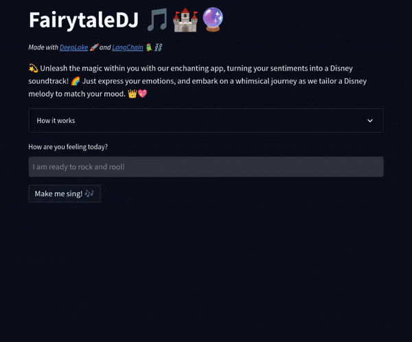
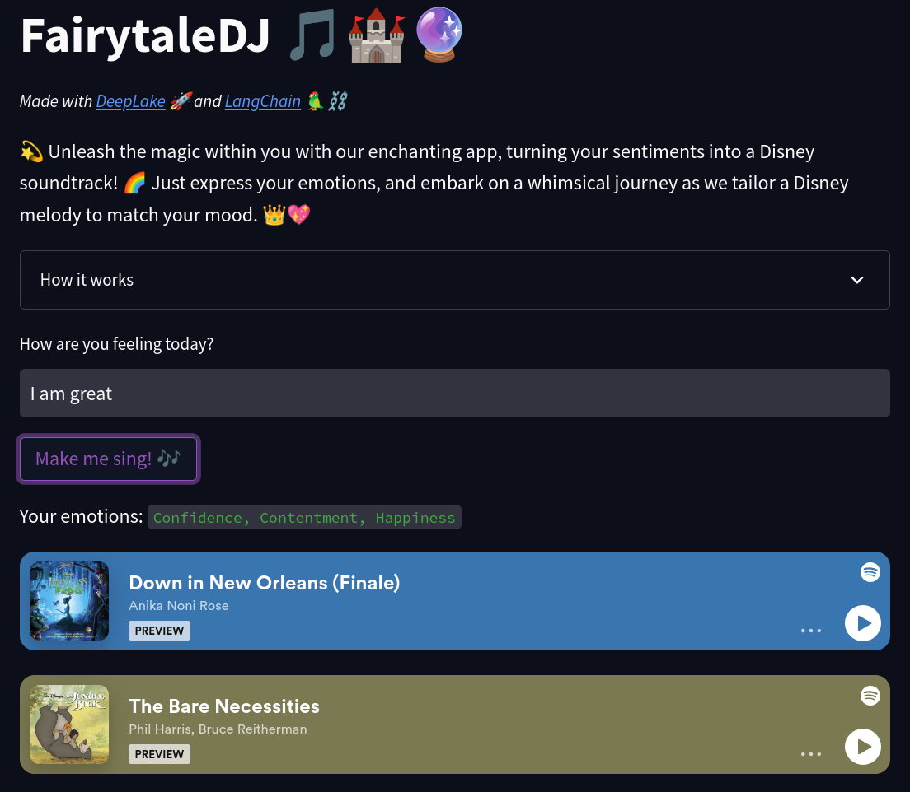

FairytaleDJ 🎵🏰🔮: Recommending Disney songs with Langchain and DeepLake

TL;DR We used [LangChain](https://python.langchain.com/en/latest/index.html), [OpenAI ChatGPT](https://openai.com/blog/chatgpt), [DeepLake](https://www.deeplake.ai/) and [Streamlit](https://streamlit.io/) to create a web app that recommends Disney songs based on a user input.



A demo is on [Hugging Face 🤗](https://huggingface.co/spaces/Francesco/FairytaleDJ)

<!-- <iframe src="https://huggingface.co/spaces/Francesco/FairytaleDJ"/> -->

Today we will see how we created [`FairytaleDJ`](https://github.com/FrancescoSaverioZuppichini/FairytaleDJ) a web app to recommend Disney songs based on user input. **The goal is simple:** We ask how the user is feeling and we want to somehow retrive Disney songs that go "well" with that input. 

For example, if the user is sad, probably a song like [Reflection from Mulan](https://www.youtube.com/watch?v=lGGXsm0a5s0) would be appropriate. 

## Getting the data

We decided to scrape `https://www.disneyclips.com/lyrics/`, a website containing all the lyrics for **all** Disney songs ever made. The code is [here](https://github.com/FrancescoSaverioZuppichini/FairytaleDJ/blob/main/scrape.py) and it relies on `asyncio` to speed up things, we won't focus too much on it.

Then, we used [Spotify Python APIs](https://spotipy.readthedocs.io/en/2.22.1/) to get all the embedding URL for each song into the ["Disney Hits" Playlist](https://open.spotify.com/playlist/37i9dQZF1DX8C9xQcOrE6T). We proceed to remove all the songs that we had scraped but are not in this playlist. By doing so, we end up with 85 songs.

We end up with a [`json`](https://github.com/FrancescoSaverioZuppichini/FairytaleDJ/blob/main/data/lyrics_with_spotify_url.json) looking like this.

```json
{
  "Aladdin": [
    {
      "name": "Arabian Nights",
      "text": "Oh, I come from a land, from a faraway place. Where the caravan camels roam. Where it's flat and immense. And the heat is intense. It's barbaric, but, hey, it's home. . When the wind's from the East. And the sun's from the West. And the sand in the glass is right. Come on down. Stop on by. Hop a carpet and fly. To another Arabian night. . Arabian nights. Like Arabian days. More often than not. Are hotter than hot. In a lot of good ways. . Arabian nights. 'Neath Arabian moons. A fool off his guard. Could fall and fall hard. Out there on the dunes. . ",
      "embed_url": "https://open.spotify.com/embed/track/0CKmN3Wwk8W4zjU0pqq2cv?utm_source=generator"
    },
    ...
  ],
```
## Data encoding
We were looking for a good way to retrieve the songs. We evaluated different approaches. The used ActiveLoop [DeepLake](https://docs.deeplake.ai/en/latest/) vector db and more specifically its implementation in [LangChain](https://python.langchain.com/en/latest/ecosystem/deeplake.html).

Creating the dataset was very easy. Given the previous `json` file, we proceed to embed the `text` field using `langchain.embeddings.openai.OpenaAIEmbeddings` and add all the rest of keys/values as `metadata`

```python
from langchain.embeddings.openai import OpenAIEmbeddings
from langchain.llms import OpenAI
from langchain.vectorstores import DeepLake

def create_db(dataset_path: str, json_filepath: str) -> DeepLake:
    with open(json_filepath, "r") as f:
        data = json.load(f)

    texts = []
    metadatas = []

    for movie, lyrics in data.items():
        for lyric in lyrics:
            texts.append(lyric["text"])
            metadatas.append(
                {
                    "movie": movie,
                    "name": lyric["name"],
                    "embed_url": lyric["embed_url"],
                }
            )

    embeddings = OpenAIEmbeddings(model="text-embedding-ada-002")

    db = DeepLake.from_texts(
        texts, embeddings, metadatas=metadatas, dataset_path=dataset_path
    )

    return db
```

To load it, we can simply:

```python
def load_db(dataset_path: str, *args, **kwargs) -> DeepLake:
    db = DeepLake(dataset_path, *args, **kwargs)
    return db
```

My `dataset_path` is `hub://<ACTIVELOOP_ORGANIZATION_ID>/<DATASET_NAME>`, but you can also store it locally. Their doc is [here](https://docs.activeloop.ai/getting-started/creating-datasets-manually)

### What didn't work

#### Similarity search of direct embeddings.
This approach was straightforward. We create embeddings for the lyrics and the user input with gpt3 and do a similarity search. Unfortunatly, we noticed very bad suggestions, this is due to the fact that we want to match user's emotions to the songs not exactly what it is saying. 

#### Using ChatGPT as a retrieval system
We also tried to nuke the whole lyrics into chatGPT and asked it to return matching songs with the user input. We had to first create a one-sentence summary of each lyric. Resulting in around 3k tokens per request (0.006$). That **did work** okayish but was overkill.
Later on, we also tried the emotional encoding that we will talk about in the next section. It had a comparable performance

### What did work: Similarity search of emotions embeddings.
We convert each lyric to a list of 8 emotions using ChatGPT. [The prompt](https://github.com/FrancescoSaverioZuppichini/FairytaleDJ/blob/main/prompts/summary_with_emotions.prompt) is the following

```text
I am building a retrieval system. Given the following song lyric

{song}

You are tasked to produce a list of 8 emotions that I will later use to retrieve the song. 

Please provide only a list of comma separated  emotions
```
For example, using the "Arabian Nights" from Aladdin (shown in the previous section), we obtained `"nostalgic, adventurous, exotic, intense, romantic, mysterious, whimsical, passionate"`. 

We then embed each emotion for each song with gpt3 and store it into 

The full script is [here](https://github.com/FrancescoSaverioZuppichini/FairytaleDJ/blob/main/scripts/create_emotions_summary.py)

Now, we need to convert the user input to a list of emotions, we used again ChatGPT with a [custom prompt](https://github.com/FrancescoSaverioZuppichini/FairytaleDJ/blob/main/prompts/bot.prompt).

```text
We have a simple song retrieval system. It accepts 8 emotions. You are tasked to suggest between 1 and 4 emotions to match the users' feelings. Suggest more emotions for longer sentences and just one or two for small ones, trying to condense the main theme of the input

Examples:

Input: "I had a great day!" 
"Joy"
Input: "I am very tired today and I am not feeling well"
"Exhaustion, Discomfort, and Fatigue"
Input: "I am in Love"
"Love"

Please, suggest emotions for input = "{user_input}", reply ONLY with a list of emotions/feelings/vibes
``` 

Here we tasked the model to provide between one and four emotions, this worked best empirically given the fact that most inputs are short.

Let's see some examples:

```
"I'm happy and sad today" -> "Happiness, Sadness"
"hey rock you" -> "Energy, excitement, enthusiasm"
"I need to cry" -> "Sadness, Grief, Sorrow, Despair" 
```

Then we used these emotions to actually perform the similarity search on the db.

```python
# we use chatGPT to get emotions from a user input
emotions = chain.run(user_input=user_input)
# we find the k more similar song
matches = db.similarity_search_with_score(emotions, distance_metric="cos", k=k)
```
Then we first filter out the low-scoring one

```python
def filter_scores(matches: Matches, th: float = 0.8) -> Matches:
    return [(doc, score) for (doc, score) in matches if score > th]

matches = filter_scores(matches, 0.8)
```
To add more variations, aka not always recommend the first one, we need to sample from the list of candidate matches. To do so, we first ensure the scores sum to one by diving by their sum.

```python
def normalize_scores_by_sum(matches: Matches) -> Matches:
    scores = [score for _, score in matches]
    tot = sum(scores)
    return [(doc, (score / tot)) for doc, score in matches]
```

Then we sample `n` songs [using a modified version](https://github.com/FrancescoSaverioZuppichini/FairytaleDJ/blob/main/utils.py) of `np.random.choice(..., p=scores)`, basically everything we sample we remove the element we have sampled. This ensures we don't sample two times the same element. 


```python
docs, scores = zip(*matches)
docs = weighted_random_sample(
    np.array(docs), np.array(scores), n=number_of_displayed_songs
).tolist()
for doc in docs:
    print(doc.metadata["name"])
```

This is basically it. We create a webapp using [Streamlit](https://streamlit.io/) and we hosted the app on an [Hugging Face space](https://huggingface.co/spaces/Francesco/FairytaleDJ)

 

That's all folks 🎉 

Thanks for reading and see you in the next one 💜

Francesco